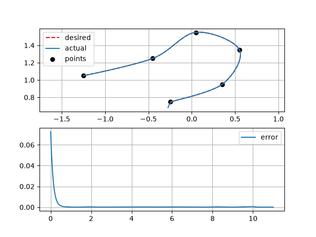

# Задание 9: обеспечить движение двухзвенного маятника через заданные декартовы ключевые точки без остановки  (параграф 9.3 из книжки Modern Robotics)


1. Задаётся несколько декартовых точек в плоскости x-z
2. Через них строится кубическая траектория согласно параграфу 9.3 «Modern Robotics».

Коэффициенты кубического сегмента вычисляются с помощью формул (9.25) - (9.29):
```text
beta(T_j + dt) = a0 + a1 dt + a2 dt^2 + a3 dt^3
```
```text
β(T_j) = β_j
β̇(T_j) = β̇_j
β(T_{j+1}) = β_{j+1}
β̇(T_{j+1}) = β̇_{j+1}
```
```text
a2 = (3β_{j+1} - 3β_j - 2β̇_jΔT_j - β̇_{j+1}ΔT_j) / ΔT_j^2
a3 = (2β_j + (β̇_j + β̇_{j+1})ΔT_j - 2β_{j+1}) / ΔT_j^3
```

3. Скорости промежуточных путевых точек рассчитываются ненулевыми, поэтому концевой эффектор проходит через них без остановок
4. На каждом шаге PyBullet вычисляет якобиан конца маятника с помощью `p.calculateJacobian`. Якобиан связывает скорости звеньев со скоростью концевого эффектора:

```text
ẋ = J(q)q̇
```
5. Чтобы получить скорости суставов, используется обратный якобиан:

```text
q̇ = J^{-1}(ẋ_des + Kp(x_des - x))
```
x_des - желаемое положение концевого эффектора  
x - текущее положение концевого эффектора  
ẋ_des - желаемая декартова скорость  
Kp(x_des - x) - поправка по ошибке  
q̇ - скорости суставов

Результат моделирования:
